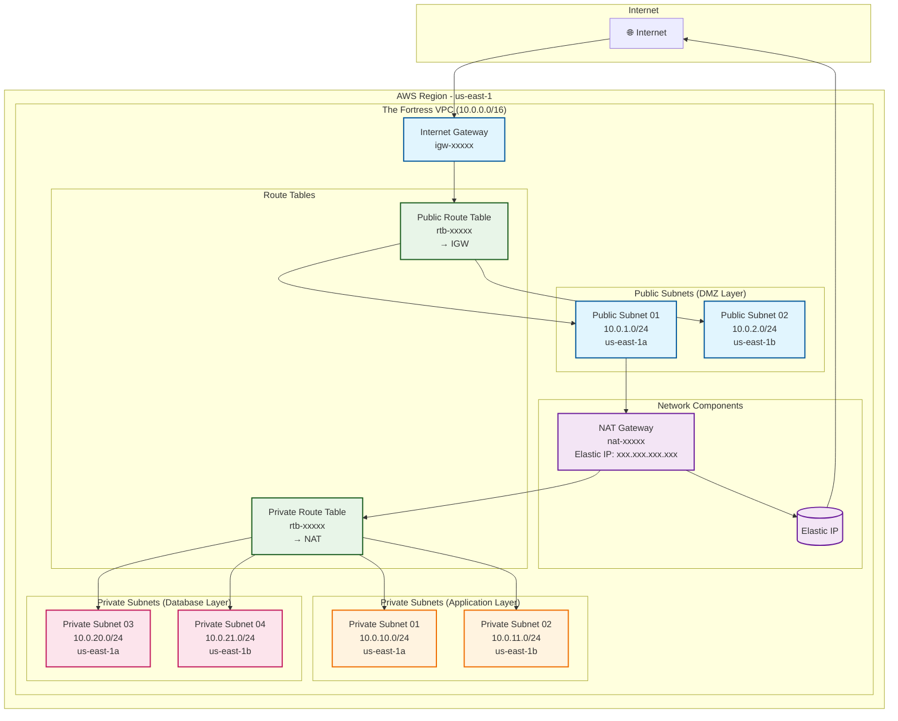

# 🛡️ The Fortress VPC - Secure Multi-Tier AWS Network Architecture

A comprehensive Terraform configuration that creates a highly secure, production-ready Virtual Private Cloud (VPC) infrastructure on AWS. This project implements a "Fortress" architecture with multiple security layers, following AWS best practices for network isolation and traffic control.

## 📋 Project Overview

**The Fortress VPC** is designed to provide a robust, scalable, and secure network foundation for modern cloud applications. The architecture implements a multi-tier design with:

- **Public DMZ Layer**: Internet-facing resources with controlled access
- **Private Application Layer**: Secure application servers
- **Private Database Layer**: Isolated database instances
- **Network Security**: Internet Gateway, NAT Gateway, and proper routing

## 🏗️ Architecture Components

### Core Infrastructure
- **VPC**: Main network container with DNS resolution enabled
- **Internet Gateway**: Enables bidirectional internet access for public subnets
- **NAT Gateway**: Provides secure outbound internet access for private subnets
- **Elastic IP**: Static public IP for NAT Gateway

### Subnet Architecture
```
Public Subnets (DMZ Layer)
├── public-subnet-01 (us-east-1a): 10.0.1.0/24
└── public-subnet-02 (us-east-1b): 10.0.2.0/24

Private Subnets (Application Layer)
├── private-subnet-01 (us-east-1a): 10.0.10.0/24
└── private-subnet-02 (us-east-1b): 10.0.11.0/24

Private Subnets (Database Layer)
├── private-subnet-03 (us-east-1a): 10.0.20.0/24
└── private-subnet-04 (us-east-1b): 10.0.21.0/24
```

### Network Security & Routing
- **Public Route Table**: Routes internet traffic through Internet Gateway
- **Private Route Table**: Routes outbound traffic through NAT Gateway
- **Route Table Associations**: Proper subnet-to-route-table mappings

## 🖼️ Network Architecture Diagram



## 🚀 Quick Start

### Prerequisites
- **AWS CLI**: Configured with appropriate permissions (`aws configure`)
- **Terraform**: v1.5.0+ installed (`terraform --version`)
- **AWS Account**: With VPC creation permissions
- **IAM Permissions**: Required policies for EC2, VPC, and networking resources
- **Region Selection**: Choose a region with available capacity

### Deployment Steps

1. **Clone and navigate to the project directory**
   ```bash
   cd The-Fortress-VPC
   ```

2. **Initialize Terraform**
   ```bash
   terraform init
   ```

3. **Review the planned infrastructure**
   ```bash
   terraform plan
   ```

4. **Deploy the VPC infrastructure**
   ```bash
   terraform apply
   ```

5. **Verify deployment**
   ```bash
   terraform output
   ```

### Configuration Variables

| Variable | Description | Default | Required |
|----------|-------------|---------|----------|
| `PROJECT_NAME` | Name prefix for all resources | `fortress-vpc` | No |
| `REGION` | AWS region for deployment | `us-east-1` | No |
| `VPC_CIDR` | CIDR block for the VPC | `10.0.0.0/16` | No |
| `PROVIDER` | Cloud provider (future use) | `aws` | No |

## 📊 Terraform Outputs

The configuration provides comprehensive outputs for integration with other infrastructure:

### Core Infrastructure Outputs
- `vpc_id` - Main VPC identifier
- `vpc_cidr_block` - VPC CIDR range
- `internet_gateway_id` - Internet Gateway ID
- `nat_gateway_id` - NAT Gateway ID
- `nat_gateway_public_ip` - NAT Gateway's public IP

### Subnet Outputs
- `public_subnet_01_id` / `public_subnet_02_id` - Public subnet IDs
- `private_subnet_app_01_id` / `private_subnet_app_02_id` - Application subnet IDs
- `private_subnet_db_01_id` / `private_subnet_db_02_id` - Database subnet IDs

### Route Table Outputs
- `public_route_table_id` - Public route table ID
- `private_route_table_id` - Private route table ID

### Consolidated Output
- `vpc_architecture_summary` - Complete infrastructure summary in JSON format

## 🔒 Security Features

### Network Isolation
- **Public subnets**: Direct internet access for load balancers, bastion hosts
- **Private subnets**: Secure application and database tiers
- **NAT Gateway**: Controlled outbound access without inbound exposure

### Traffic Flow Security
- **Inbound**: Only through Internet Gateway to public subnets
- **Outbound**: NAT Gateway provides secure egress for private resources
- **Inter-tier**: Isolated communication between application and database layers

### Best Practices Implemented
- Multi-AZ deployment for high availability
- Proper CIDR allocation (no overlap)
- Resource tagging for cost tracking and management
- DNS resolution enabled for internal service discovery

## 🧹 Cleanup

To destroy the infrastructure:

```bash
terraform destroy
```

⚠️ **Warning**: This will permanently delete all resources created by this configuration.

## � Troubleshooting

### Common Issues

**Terraform Validation Errors**
- Ensure AWS credentials are configured: `aws configure`
- Check region permissions for VPC creation
- Verify Terraform version: `terraform --version`

**Resource Creation Failures**
- Check AWS service limits (VPC, subnet, IGW quotas)
- Ensure unique resource names if deploying multiple times
- Verify CIDR blocks don't conflict with existing VPCs

**Connectivity Issues**
- Confirm NAT Gateway is in a public subnet
- Check route table associations
- Verify security group rules allow necessary traffic

### Getting Help
- Check Terraform outputs: `terraform output`
- Review AWS CloudTrail for API errors
- Use `terraform state list` to verify created resources

## �📁 Project Structure

```
The-Fortress-VPC/
├── main.tf              # Main infrastructure configuration
├── providers.tf         # AWS provider configuration
├── variables.tf         # Input variables with descriptions
├── outputs.tf           # Output values for resource IDs
├── terraform.tfvars     # Variable overrides (if needed)
└── README.md           # This documentation
```

## 🎯 Use Cases

This VPC architecture is ideal for:

- **Web Applications**: Public load balancers, private application servers
- **Microservices**: Isolated service tiers with controlled communication
- **Databases**: Secure database instances in private subnets
- **Dev/Test Environments**: Isolated networks for development teams
- **Production Workloads**: Enterprise-grade network security

## 🤝 Contributing

1. Fork the repository
2. Create a feature branch
3. Make your changes
4. Test thoroughly
5. Submit a pull request

## 📄 License

This project is licensed under the MIT License - see the LICENSE file for details.

---

**Built with ❤️ using Terraform on AWS**
